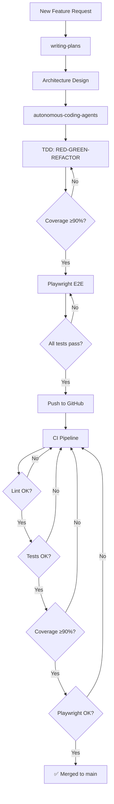

# SplitEasy Development Workflow

This document defines the **end-to-end development workflow** for SplitEasy. Every feature or change follows this pipeline in sequence.

```
┌──────────────────┐
│ 1. Writing Plans │  ← Define what to build via bite-sized tasks
├──────────────────┤
│ 2. Architecture  │  ← Design the system (Docker Compose, stack, data model)
├──────────────────┤
│ 3. Autonomous    │  ← Delegate implementation to AI coding agents
│    Coding Agents │     (parallel file writes, subagents)
├──────────────────┤
│ 4. TDD           │  ← Red-Green-Refactor: 90%+ code coverage
├──────────────────┤
│ 5. Playwright    │  ← E2E browser tests for all user flows
├──────────────────┤
│ 6. CI/CD         │  ← GitHub Actions: lint → test → coverage → Playwright
└──────────────────┘
```

---

## 1. Writing Plans

**Skill:** [`writing-plans`](.hermes/skills/software-development/writing-plans/SKILL.md)

Every feature starts with a plan document saved to `.hermes/plans/`. Plans follow the `writing-plans` skill format:

- **Bite-sized tasks** (2-5 minutes each)
- **Exact file paths** with complete code examples
- **Exact commands** with expected output
- **Verification steps** for each task
- **DRY, YAGNI, TDD** principles

**Output:** A markdown plan at `.hermes/plans/YYYY-MM-DD-feature-name.md`

---

## 2. Architecture

**Skill:** [`writing-plans`](.hermes/skills/software-development/writing-plans/SKILL.md) (Architecture Selection section)

Before any code is written, the architecture is documented in the plan:

### Default Stack (Docker Compose)

| Service | Tech | Role |
|---------|------|------|
| Database | PostgreSQL 16 (`postgres:16-alpine`) | Primary data store |
| Cache | Redis 7 (`redis:7-alpine`) | Session caching layer |
| Backend | Express.js + TypeScript REST API | Business logic + JWT auth |
| Frontend | React 19 + Vite + shadcn/ui | SPA with Vite proxy → backend |

### Key Patterns

- **Health checks** on postgres/redis with `depends_on: condition: service_healthy`
- **Volume mounts** for hot-reload during development
- **Vite proxy** to forward `/api` → backend container
- **Auto-migrations** via `docker-entrypoint-initdb.d/`
- **JWT auth** (jsonwebtoken + bcryptjs) — simpler than OAuth for local dev

---

## 3. Autonomous Coding Agents

**Skill:** [`autonomous-coding-agents`](.hermes/skills/software-development/autonomous-coding-agents/SKILL.md)

After the plan is written, implementation is delegated to autonomous coding agents for **faster parallel execution**.

### How It Works

1. The plan is split into **independent batches** (backend, frontend, tests, config)
2. Each batch is dispatched via `delegate_task` to a subagent with:
   - Full plan context (file paths, code examples, constraints)
   - Relevant toolsets (`terminal`, `file`, `web` as needed)
   - TDD instructions (test-first requirement)
3. Subagents execute in **parallel** where possible (up to 3 concurrent)
4. Results are verified against the plan's acceptance criteria

### Batching Strategy

```
Batch 1: Backend (models, routes, services)
Batch 2: Frontend (components, pages, hooks)
Batch 3: Tests (unit, integration, E2E)
Batch 4: Config (CI/CD, Docker, docs)
```

### ACP Agents (Optional)

For even faster execution, use ACP-compatible CLIs (Claude Code, OpenAI Codex) when available. See the `autonomous-coding-agents` skill for setup.

---

## 4. Test-Driven Development

**Skill:** [`test-driven-development`](.hermes/skills/software-development/test-driven-development/SKILL.md)

All code is written using **strict TDD** — Red-Green-Refactor — targeting **90%+ code coverage**.

### The Iron Law

```
NO PRODUCTION CODE WITHOUT A FAILING TEST FIRST
```

### Coverage Targets

| Layer | Tool | Target | Command |
|-------|------|--------|---------|
| Backend | Jest + ts-jest | ≥90% lines | `npm test -- --coverage` |
| Frontend | Vitest | ≥90% lines | `npm test -- --coverage` |
| E2E | Playwright | Core flows | `npx playwright test` |

### RED Phase

1. Write one failing test for the desired behavior
2. Run it — must fail with the expected reason (feature missing, not a typo)
3. **Never skip watching the test fail**

### GREEN Phase

1. Write minimal code to pass the test
2. Cheating is OK: hardcode, copy-paste, skip edge cases
3. Run the test — must pass

### REFACTOR Phase

1. Clean up duplication, naming, structure
2. Keep tests green throughout
3. Add no new behavior

### Test File Structure

```
backend/
└── src/
    ├── routes/         ← Route handlers
    │   ├── auth.ts
    │   └── __tests__/  ← Co-located tests
    │       └── auth.test.ts
    ├── services/       ← Business logic
    │   ├── balance.ts
    │   └── __tests__/
    │       └── balance.test.ts
    └── middleware/
        ├── auth.ts
        └── __tests__/
            └── auth.test.ts

frontend/
└── src/
    ├── pages/
    │   ├── Login.tsx
    │   └── __tests__/
    │       └── Login.test.tsx
    ├── hooks/
    │   ├── use-auth.ts
    │   └── __tests__/
    │       └── use-auth.test.ts
    └── components/
        └── ui/
            ├── button.tsx
            └── __tests__/
                └── button.test.tsx
```

---

## 5. Playwright E2E Tests

After unit tests pass (≥90% coverage), **Playwright** runs end-to-end browser tests covering all core user flows.

### Test Scenarios

```typescript
// e2e/auth.spec.ts
test('user can register, login, and see dashboard', async ({ page }) => { ... });
test('unauthenticated user is redirected to login', async ({ page }) => { ... });

// e2e/groups.spec.ts
test('user can create a group', async ({ page }) => { ... });
test('group detail shows members and empty expenses', async ({ page }) => { ... });

// e2e/expenses.spec.ts
test('user can create an equal-split expense', async ({ page }) => { ... });
test('expense appears in group list after creation', async ({ page }) => { ... });

// e2e/settle.spec.ts
test('user can record a settlement payment', async ({ page }) => { ... });
test('payment appears in history', async ({ page }) => { ... });
```

### Running Locally

```bash
# Install Playwright browsers (first time only)
npx playwright install chromium

# Start the app
docker compose up -d

# Run E2E tests
npx playwright test

# With UI mode
npx playwright test --ui

# With HTML report
npx playwright test --reporter=html
```

### CI Integration

Playwright runs in the CI pipeline after unit tests pass. See `.github/workflows/ci.yml`.

---

## 6. CI/CD Pipeline (GitHub Actions)

**File:** `.github/workflows/ci.yml`

Every push to `main` or any PR triggers the CI pipeline:

```
┌──────────────────────────────────────┐
│  Trigger: push / pull_request → main │
├──────────────────────────────────────┤
│  1. Lint                             │
│     ├── backend: tsc --noEmit        │
│     └── frontend: tsc --noEmit       │
├──────────────────────────────────────┤
│  2. Unit Tests + Coverage            │
│     ├── backend: jest --coverage     │
│     │   └── ≥90% lines               │
│     └── frontend: vitest --coverage  │
│         └── ≥90% lines               │
├──────────────────────────────────────┤
│  3. Build Check                      │
│     ├── backend: npm run build       │
│     └── frontend: npm run build      │
├──────────────────────────────────────┤
│  4. Playwright E2E                   │
│     ├── Start docker compose         │
│     ├── Seed database                │
│     └── npx playwright test          │
├──────────────────────────────────────┤
│  5. Report                           │
│     ├── Coverage reports (Codecov)   │
│     └── Playwright HTML report       │
└──────────────────────────────────────┘
```

### Coverage Gate

If any coverage drops below **90%**, the pipeline **fails**. This is enforced by Jest/Vitest coverage thresholds in `jest.config.ts` and `vitest.config.ts`.

```typescript
// jest.config.ts
export default {
  collectCoverage: true,
  coverageThreshold: {
    global: {
      lines: 90,
      functions: 90,
      branches: 80,
      statements: 90,
    },
  },
};
```

---

## Putting It All Together

### New Feature Checklist

```
[ ] Plan written to .hermes/plans/  (writing-plans skill)
[ ] Architecture documented          (Docker Compose + stack)
[ ] Implementation delegated         (autonomous-coding-agents skill)
[ ] TDD followed: every function has a failing test first  (≥90%)
[ ] Playwright E2E tests pass
[ ] CI pipeline green (lint → tests → coverage → Playwright)
[ ] PR merged to main
```

### Quick Start for Contributors

```bash
# 1. Clone and start
git clone https://github.com/wong-johnathan/splitwise.git
cd splitwise
docker compose up -d --build

# 2. Seed data
docker compose exec backend npm run seed

# 3. Run tests
# Backend unit tests
docker compose exec backend npm test

# Frontend unit tests
docker compose exec frontend npm test

# E2E tests (requires host browser)
npx playwright test

# 4. View coverage
docker compose exec backend npm test -- --coverage
docker compose exec frontend npm test -- --coverage
open coverage/lcov-report/index.html
```

---

## Workflow Diagram



---

*This workflow is enforced by CI. Every PR must pass all gates.*
